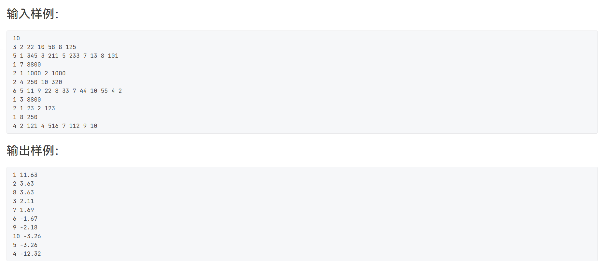

# 感谢各位关注~

## L1

### 1.新世界(5分)


```c++
#include<iostream>
using namespace std;
int main()
{
	cout << "Hello World\nHello New World";
	return 0;
}
/*
	签到题
*/
```

### 2.打折


```c++
#include<iostream>
using namespace std;
int main()
{
	int price, zk;
	cin >> price >> zk;
	printf("%.2lf", price * zk / 10.0);
	return 0;
}
/*
	这道题要注意小数
*/
```

### 3.奇偶分家


```c++
#include<iostream>
using namespace std;
int main()
{
	int n;
	cin >> n;
	int js = 0, os = 0;
	while (n--)
	{
		int data;
		cin >> data;
		if (data % 2 == 0)
			os++;
		else
			js++;
	}
	cout << js << " " << os << endl;
	return 0;
}
/*
	签到题
*/
```

### 4.冠军魔术


```c++
#include<iostream>
using namespace std;
#include<cmath>
int main()
{
	int crads, times;
	cin >> crads >> times;
	crads = crads * pow(2, times / 2);
	if (times % 2 == 0)
		cout << 0 << " " << crads;
	else
		cout << 1 << " " << crads;
	return 0;
}
/*
	通过阅读题目我们可以得知，一次来回硬币(纸牌)的数量会翻两倍，并且奇数
次的时候会变成硬币，我们可以通过pow函数来计算cards的数量，并且对次数进行
对2去模来判断cards是硬币还是函数
*/
```

### 5.判断题 


```c++
#include<vector>
#include<iostream>
using namespace std;
int main()
{
	int n, m;
	cin >> n >> m;
	vector<int>grade(m);//存放每题的分数
	vector<int>answer(m);//存放题目的答案
	for (int i = 0; i <m ; i++)//获取成绩的值
	{
		cin >> grade[i];
	}
	for (int i = 0; i < m; i++)//获取题目的正确答案
	{
		cin >> answer[i];
	}
	for (int i = 0; i < n; i++)
	{
		int res = 0;
		for (int j = 0; j < m; j++)
		{
			int t;
			cin >> t;
			if (t == answer[j])
				res += grade[j];
		}
		cout << res << endl;
	}
	return 0;
}
/*
	通过阅读题目我们可以得知，我们需要定义个数组存放题目的答案和分数，然
后判断学生是否答对，然后对其进行累加
*/
```

### 6.检查密码


```c++
#include<iostream>
using namespace std;
#include<string>
int main()
{
	int n;
	cin >> n;
	string s;
	int flag = 0;
	getchar();
	while (n--)
	{
		getline(cin, s);
		if (s.length() < 6)
		{
			if (flag)
				cout << endl;
			cout << "Your password is tai duan le." ;
		}
		else
		{
			int digst = 0, letter = 0, other = 0, dot = 0;
            //定义digst，letter，other，dot分别存放字母，数字，其他
            //字符和小数点的数目
			for (auto& ch : s)
			{
				if (ch >= 'a' && ch <= 'z' || ch >= 'A' && ch <= 'Z')
					letter++;
				else if (ch >= '0' && ch <= '9')
					digst++;
				else if (ch == '.')
					dot++;
				else
					other++;
			}
			if (other > 0 || digst == 0 && letter == 0)
			{
				if (flag)
					cout << "\n";
				cout << "Your password is tai luan le.";
			}
			else if (digst == 0)
			{
				if (flag)
					cout << "\n";
				cout << "Your password needs shu zi.";
			}
			else if (letter == 0)
			{
				if (flag)
					cout << "\n";
				cout << "Your password needs zi mu.";
			}
			else {
				if (flag)
					cout << "\n";
				cout << "Your password is wan mei.";
			}
		}
		flag = 1;
	}
	return 0;
}
/*
	注意：我们不能通过cin>>s这种方式获取字符串，因为字符串中可能含有空
格，cin会忽略空格，我们要用getline(cin,s)获取字符字符串，同时也要小心
我们之前用cin获取n，缓冲区中还有\n符号，下一次getline(cin,s)会获取到
空，所以我们要用getchar()获取掉那个空字符
*/
```

### 7.谷歌的招聘


```c++
#include<iostream>
using namespace std;
#include<string>

bool isPrime(int x)
{
	if (x < 2)
		return false;
	for (int i = 2; i * i <= x; i++)
	{
		if (x % i == 0)
			return false;
	}
	return true;
}

int main()
{
	string s;
	int n, k;
	cin >> n >> k;
	cin >> s;
	for (int i = 0; i <= n - k; i++)
	{
		string str = s.substr(i, k);
		if (isPrime(stoi(str)))
		{
			cout << str << endl;
			return 0;
		}
	}
	cout << 404 << endl;
	return 0;
}
/*
	阅读题目，我们只需把那串数字当作字符串来看待，每次获取k个字符转化为数
字然后判断是否为质数即可
*/
```

### 8.阅览室


```c++
#include<iostream>
using namespace std;
bool st[1005];//st[i]记录第i本书的借出情况，1为借出
int ti[1005];//ti[i]记录第i本书借出的时间
int main()
{
	int n;
	cin >> n;
	double res = 0;
	int cnt = 0;
	while (n > 0)
	{
		int id, h, m, t; char ch;
		cin >> id >> ch;
		scanf("%d:%d", &h, &m);
		t = h * 60 + m;
		if (ch == 'S') {
			st[id] = 1;
			ti[id] = t;
		}
		if (ch == 'E' && st[id] == 1)
		{
			res += t - ti[id];
			st[id] = 0;
			cnt++;
		}
		if (id == 0)
		{
			for (int i = 0; i < 1005; i++)
				st[i] = 0;
			if (cnt > 0)
				res /= cnt;
			printf("%d %.0lf\n", cnt, res);
			n--;
			res = cnt = 0;
		}
	}
}
/*
	简单的模拟题，注意输出的为整数，要忽略单个的s和E情况
*/
```

## L2

### 1.出栈序列的合法性


```c++
#include<iostream>
using namespace std;
#include<string>
#include<stack>
int main()
{
	int m, n, k;
	cin >> m >> n >> k;
	for (int i = 0; i < k; i++)
	{
		stack<int>s;
		bool flag = true;
		int start = 1;
		for (int j = 0; j < n; j++)
		{
			int num;
			cin >> num;
			while (start<=num)
			{
				s.push(start++);
			}
			if (!s.empty() && s.size()<=m && num == s.top())
			{
				s.pop();
			}
			else {
				flag = false;
			}
		}
		if (flag)
		{
			cout << "YES" << endl;
		}
		else {
			cout << "NO" << endl;
		}
	}
	return 0;
}
/*
	直接使用模拟的方法，用start记录已经入栈到的数字，当入栈小于输出的树
的时候，将其补充到出的数，然后数小于栈顶的时候，判断是否和栈顶相等，不相等
说明错误
*/
```

### 2.抢红包




```c++
#include<iostream>
using namespace std;
#include<vector>
#include<algorithm>
class Person {
public:
	int id;
	int money;
	int sum;
	Person() {

	}
	Person(int _id) :id(_id) {
		money = 0;
		sum = 0;
	}
};
int main()
{
	int n;
	cin >> n;
	vector<Person>data(n);
	for (int i = 0; i < n; i++) {
		Person p(i+1);
		data[i] = p;
	}
	for (int i = 0; i <n; i++)
	{
		int count;
		cin >> count;
		while (count--)
		{
			int id, money;
			cin >> id >> money;
			data[i].money -= money;
			data[id-1].money += money;
			data[id - 1].sum++;
		}
	}
	sort(data.begin(), data.end(), [](const Person& p1, const Person& p2) {
		if (p1.money== p2.money)
		{
			if (p1.sum == p2.sum)
			{
				return p1.id < p2.id;
			}
			return p1.sum > p2.sum;
		}
		else
			return p1.money > p2.money;
		});
	for (auto& p : data)
	{
		printf("%d %.2lf\n", p.id, p.money / 100.0);
	}
}
/*
	模拟题，只需要使用结构体进行模拟，然后存放在data里面使用lambda表达
式进行排序
*/
```

### 3.二叉搜索树的2层结点统计


```c++
#include<iostream>
using namespace std;
#include<queue>
class TreeNode {
public:
	int val;
	TreeNode* left;
	TreeNode* right;
	TreeNode() :val(0), left(nullptr), right(nullptr){}
	TreeNode(int _val):val(_val),left(nullptr),right(nullptr){}
};

void addNode(TreeNode* root,int _val)
{
	while (1)
	{
		if (_val <= root->val)
		{
			if (root->left == nullptr)
			{
				root->left = new TreeNode(_val);
				return;
			}
			root = root->left;
		}
		else
		{
			if (root->right == nullptr)
			{
				root->right = new TreeNode(_val);
				return;
			}
			root = root->right;
		}
	}
}
/*
输出二叉树调试
void fun(TreeNode* root)
{
	if (root != nullptr)
	{
		cout << root->val << endl;
		fun(root->left);
		fun(root->right);
	}
}
*/
int main()
{
	
	int n;
	cin >> n;
	n--;
	int t;
	cin >> t;
	TreeNode* root = new TreeNode(t);
	while (n--)
	{
		int t;
		cin >> t;
		addNode(root, t);
	}
	vector<int>data;
	queue<TreeNode*>q;
	q.push(root);
	while (!q.empty())
	{	
		int size = q.size();
		for (int i = 0; i < size; i++)
		{
			TreeNode* p = q.front();
			q.pop();
			if (p->left != nullptr)
				q.push(p->left);
			if (p->right != nullptr)
				q.push(p->right);
		}
		data.push_back(size);
	}
	if (data.size() >= 2)
		cout << data[data.size() - 1] + data[data.size() - 2] << endl;
	else
		cout << data[0] << endl;
	return 0;
}
/*
	这题我们可以先构建二叉搜索树，然后再用广度遍历将数据存入vector<int>
然后用计算最后两个位置的和，计算和的时候要判断他是否为1个，不然会出现错误
*/
```

