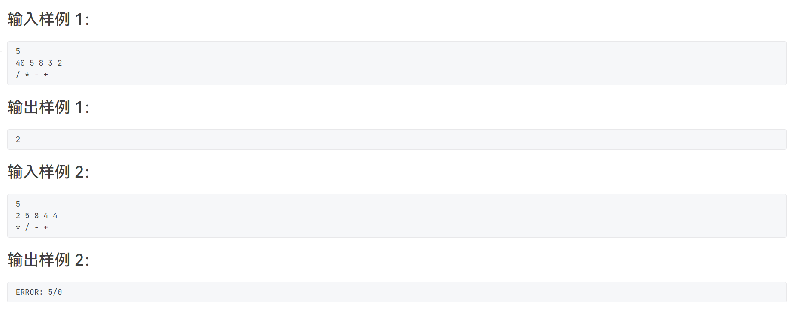

# 感谢各位关注~

## L1

### 1.嫑废话上代码


```c++
#include<iostream>
using namespace std;
int main()
{
    cout<<"Talk is cheap. Show me the code."<<endl;
}
```

> 简单的签到题

### 2.猫是液体


```c++
#include<iostream>
using namespace std;
int main()
{
    int a,b,c;
    cin>>a>>b>>c;
    cout<<a*b*c<<endl;
}
```

> 简单的签到题

### 3.洛希极限


```c++
#include<iostream>
using namespace std;
int main()
{
    double a,b,c;
    cin>>a>>b>>c;
    if(b==0)
        a*=2.455;
    else 
        a*=1.26;
    printf("%.2lf ",a);
    if(a>=c)
        cout<<"T_T"<<endl;
    else 
        cout<<"^_^"<<endl;
    return 0;
}
```

> 简单的签到题

### 4.调和平均

```C++
#include<iostream>
using namespace std;
#include<vector>
int main()
{
    int n;
    double sum=0;
    cin>>n;
    for(int i=0;i<n;i++)
    {
        double t;
        cin>>t;
        sum+=1/t;
    }
    sum/=n;
    sum=1/sum;
    printf("%.2lf\n",sum);
}
```

> 简单的签到题

### 5.胎压检测


```c++
#include<iostream>
using namespace std;
#include<vector>
#include<algorithm>
int main()
{
	vector<int>data(4);
	for (int i =0 ; i < 4; i++)
	{
		cin >> data[i];
	}
	int min_data,cz;
	cin >> min_data>>cz;
	int max_data = *max_element(data.begin(), data.end());
	int cnt = 0;5
	int dcnt = 0;
	int mydata;
	for (int i=0;i<4;i++)
	{
		if (max_data - data[i] > cz)
		{
			mydata = i;
			cnt++;
		}
		if (data[i] < min_data)
		{
			mydata = i;
			dcnt++;
		}
	}
	if (cnt == 0 && dcnt == 0)
	{
		cout << "Normal" << endl;
	}
	else if (cnt + dcnt == 1)
	{
		cout << "Warning: please check #" << mydata+1<< "!";
	}
	else {
		cout << "Warning: please check all the tires!" << endl;
	}
	return 0;
}
```

> 简单的签到题,用cnt和dcnt来记录轮胎故障的数量

### 6.吃火锅


```c++
#include<iostream>
using namespace std;
#include<string>
#include<vector>
int main()
{
	int ans = 0;
	vector<int>cnt;
	while (1)
	{
		string s;
		getline(cin, s);
		if (s == ".")
			break;
		ans++;
		if (s.find("chi1 huo3 guo1") != -1)
			cnt.push_back(ans);
			
	}
	cout << ans << endl;
	if (cnt.size())
		cout << cnt[0]<<" "<<cnt.size() << endl;
	else
		cout << "-_-#" << endl;
	return 0;
}
```

> 简单的签到题，注意获取行要用getline(cin,str)，ans来记录第几个，如果找到则推入cnt

### 7.前世档案


```c++
#include<iostream>
using namespace std;
int main()
{
    int n,m;
    cin>>n>>m;
    while(m--)
    {
        string s;
        cin>>s;
        int res=1;
        for(auto&ch:s)
        {
            if(ch=='y')
                res=2*res-1;
            else 
                res=2*res;
        }
        cout<<res<<endl;
    }
}
```

> 一道简单的签到题目，只需要掌握其中规律，即向左是乘以2-1，向右乘以2

### 8.刮刮彩票


```c++
#include<iostream>
using namespace std;
#include<vector>
#include<unordered_map>
int main()
{
	unordered_map<int, int>map = { {6,10000},{7,36},{8,720},{9,360},{10,80},{11,252},
		{12,108},{13,72},{14,54},{15,180},{16,72},{17,180},{18,119},{19,36},{20,306},
		{21,1080},{22,144},{23,1800},{24,3600} };
	int a[4][4];
	pair<int, int>data;
	vector<bool>vis(10, false);
	for (int i = 1; i < 4; i++)
	{
		for (int j = 1; j < 4; j++)
		{
			cin >> a[i][j];
			vis[a[i][j]] = true;
			if (a[i][j] == 0)
				data = { i,j };
		}
	}
	for (int i = 1; i < 10; i++)
	{
		if (!vis[i])
			a[data.first][data.second] = i;
	}
	for (int i = 0; i < 3; i++)
	{
		int x, y;
		cin >> x >> y;
		cout << a[x][y] << endl;
	}
	int sum = 0;
	int t;
	cin >> t;
	if (t <= 3)
	{
		for (int i = 1; i < 4; i++)
		{
			sum += a[t][i];
		}
	}
	else if (t <= 6) {
		for (int i = 1; i < 4; i++)
		{
			sum += a[i][t - 3];
		}
	}
	else if (t == 7)
	{
		sum += a[1][1] + a[2][2] + a[3][3];
	}
	else
	{
		sum += a[1][3] + a[2][2] + a[3][1];
	}
	cout << map[sum] << endl;
}
```

> 我们发现彩票的点数是从1-9，而数据会给你1-9八个数和一个0，可以发现那个0所在的位置就是1-9没有出现过的值，我们可以用一个数组来纪录是否出现，然后进行补充，可以用哈希表来存储对应点数和的金币数目

## L2

### 1.简单计算器




```c++
#include<iostream>
using namespace std;
#include<stack>
int main()
{
	stack<int>s1;
	stack<char>s2;
	int n;
	cin >> n;
	for (int i = 0; i < n; i++)
	{
		int t;
		cin >> t;
		s1.push(t);
	}
	for (int i = 0; i < n-1; i++)
	{
		char t;
		cin >> t;
		s2.push(t);
	}
	int flag = 1;
	while (!s2.empty())
	{
		char ch = s2.top();s2.pop();
		int a = s1.top(); s1.pop();
		int b = s1.top(); s1.pop();
		if (ch == '+')
			b = b + a;
		if (ch == '-')
			b = b - a;
		if (ch == '*')
			b = b * a;
		if (ch == '/')
		{
			if (a == 0)
			{
				printf("ERROR: %d/0\n", b);
				return 0;
			}			
			else
				b = b / a;
		}
		s1.push(b);
	}
	if (flag)
		cout << s1.top() << endl;
	return 0;
}
```

> 一道简单的模拟题，模拟即可

### 2.口罩发放


```c++
#include<iostream>
using namespace std;
#include<vector>
#include<unordered_map>
#include<algorithm>
#include<set>
struct node
{
	string name;
	string sfz;
	int body;
	int hh;
	int mm;
	int pos;
};
unordered_map<string, int>day;//口罩发放时间
bool cmp(node x, node y)
{
	if (x.hh != y.hh)
		return x.hh < y.hh;
	else if (x.mm != y.mm)
		return x.mm < y.mm;
	return x.pos < y.pos;
}
vector<node>request;
vector<node>hz;
int main()
{
	int d, p;
	cin >> d >> p;
	vector<node>res;
	for (int i = 1; i <= d; i++)
	{
		int n, m;//申请数和口罩数量
		cin >> n >> m;
		for(int j=1;j<=n;j++)
		{
			node t;
			char c;
			cin >> t.name >> t.sfz >> t.body >> t.hh >> c >> t.mm;
			t.pos = j;
			int len = t.sfz.size();
			if (len != 18)
				continue;
			int flag = 0;
			for (auto& ch : t.sfz)
			{
				if (!isdigit(ch))
				{
					flag = 1;
					break;
				}
			}
			if (flag)
				continue;
			if (t.body)
				hz.push_back(t);
			request.push_back(t);
		}
		sort(request.begin(), request.end(),cmp);
		int len = request.size();
		for (int j = 0; j < len; j++)
		{
			if (m == 0)
				break;
			if (day[request[j].sfz] == 0 || i >= p + day[request[j].sfz] + 1)
			{
				res.push_back(request[j]);
				day[request[j].sfz] = i;
				m--;
			}
		}
		request.clear();
	}
	for (auto& i : res)
		cout << i.name << " " << i.sfz << endl;
	set<string>s;
	for (int x = 0; x < hz.size(); x++)
	{
		if (!s.count(hz[x].sfz))
		{
			cout << hz[x].name << " " << hz[x].sfz << endl;
			s.insert(hz[x].sfz);
		}
	}
}
```

> 按照题目模拟，用哈希表记录每次领取的时间，然后记录病患，最后判断是否重复输出

### 3.完全二叉树的层序遍历


```c++

```

