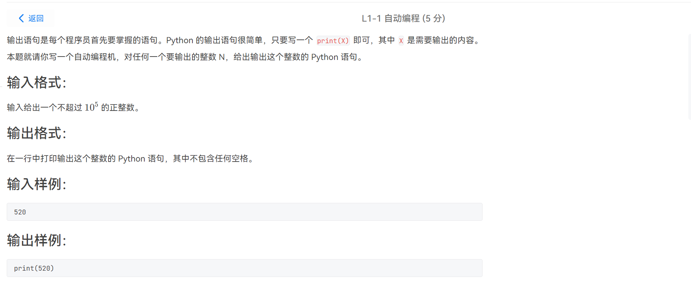
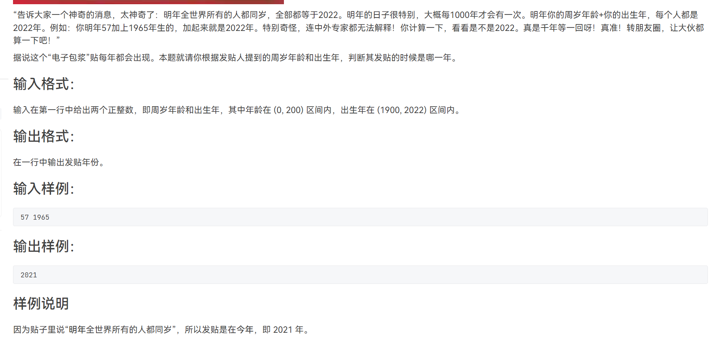
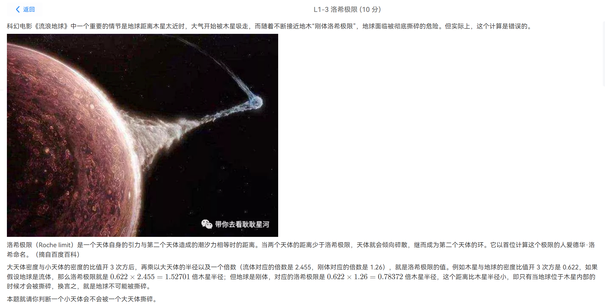
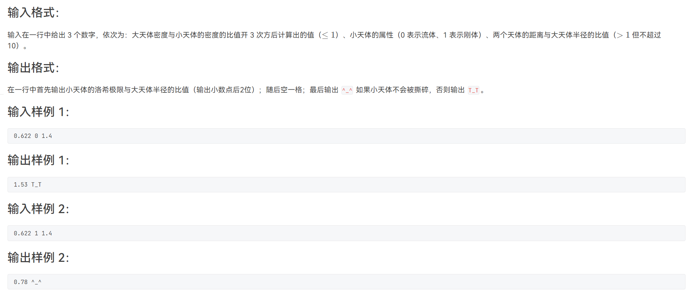
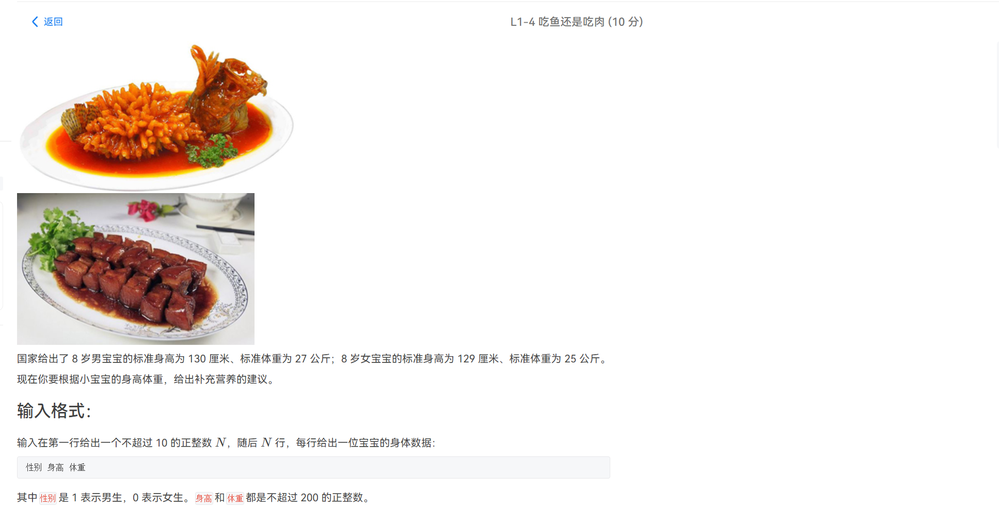
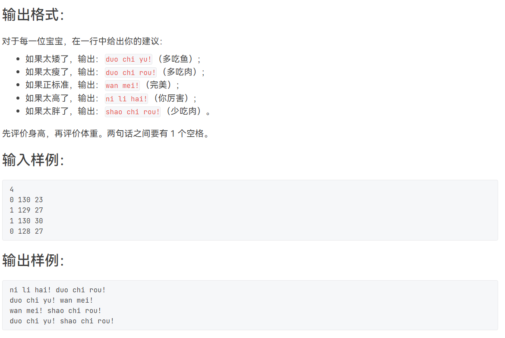
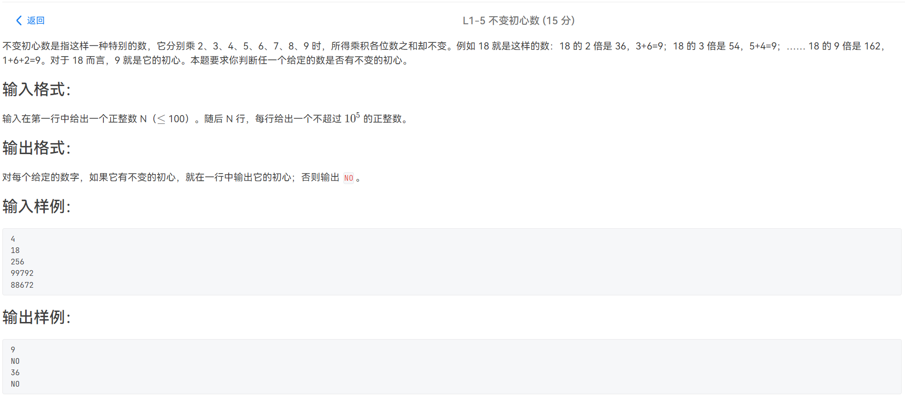
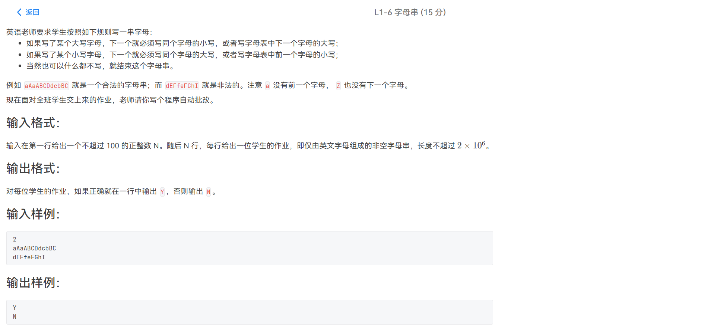
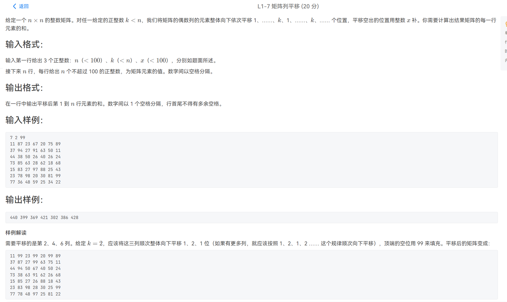
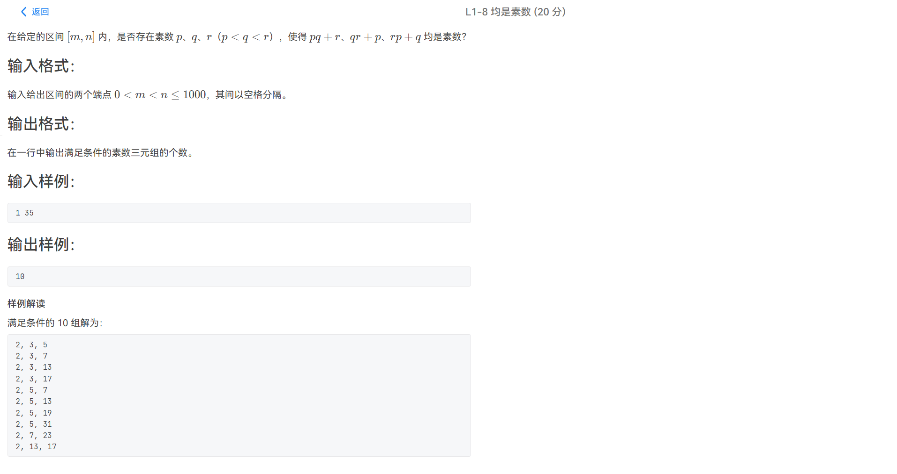

# 感谢各位关注~

##  L1

### 1.自动编程



```c++
#include<iostream>
using namespace std;
int main()
{
    int n;
    cin>>n;
    printf("print(%d)\n",n);
}
```

> 签到题

### 2.太神奇了



```c++
#include<iostream>
using namespace std;
int main()
{
    int a,b;
    cin>>a>>b;
    cout<<a+b-1<<endl;
}
```

> 别看题目有点迷茫，其实就是给你两个数返回和减一

### 3.洛希极限





```c++
#include<iostream>
using namespace std;
int main()
{
    double a,b,c;
    cin>>a>>b>>c;
    if(b==0)
        a*=2.455;
    else 
        a*=1.26;
    printf("%.2lf ",a);
    if(a<c)
        cout<<"^_^"<<endl;
    else 
        cout<<"T_T"<<endl;
}
```

> 简单的签到题目

### 4.吃鱼还是吃肉

​	



```c++
#include<iostream>
using namespace std;
int main()
{
    int n;
    cin>>n;
    while(n--)
    {
        int sex,hight,kg;
        cin>>sex>>hight>>kg;
        int hight_bz, kg_bz;
        if(sex==1)
        {
            hight_bz=130;
            kg_bz=27;
        }else {
            hight_bz=129;
            kg_bz=25;
        }
        if(hight<hight_bz)
        {
            cout<<"duo chi yu! ";
        }else if(hight==hight_bz)
        {
            cout<<"wan mei! ";
        }else {
            cout<<"ni li hai! ";
        }
        if(kg<kg_bz)
        {
            cout<<"duo chi rou!"<<endl;
        }else if(kg==kg_bz)
        {
            cout<<"wan mei!"<<endl;
        }else {
            cout<<"shao chi rou!"<<endl;
        }
    }
}
```

> 签到题，按照题目意思输出打印即可

### 5.不变初心数



```c++
#include<iostream>
using namespace std;

int getData(int n)
{
    int sum=0;
    while(n)
    {
        sum+=n%10;
        n/=10;
    }
    return sum;
}
int main()
{
    int n;
    cin>>n;
    while(n--)
    {
        int t;
        cin>>t;
        int res=getData(t*2);
        int flag=1;
        for(int i=3;i<=9;i++)
        {
            if(getData(i*t)!=res)
            {
                flag=0;
                break;
            }
        }
        if(flag)
            cout<<res<<endl;
        else 
            cout<<"NO"<<endl;
    }
}
```

> 签到题，按照题目意思模拟即可

### 6.字符串



```c++
#include<iostream>
using namespace std;
#include<string>
int main()
{
	int n;
	cin >> n;
	while (n--)
	{
		string s;
		cin >> s;
		int size = s.size();
		int flag = 1;
		for (int i = 0; i < size-1; i++)
		{
			char ch = s[i];
			if (ch >= 'a'&&ch <= 'z')
			{
				if (s[i + 1] != ch - 'a' + 'A'&&s[i + 1] != ch - 1)
				{
					flag = 0;
					break;
				}
			}
			else
			{
				if (s[i + 1] != ch - 'A' + 'a'&&s[i + 1] != ch + 1)
				{
					flag = 0;
					break;
				}
			}

		}
		if (flag)
			cout << "Y" << endl;
		else
			cout << "N" << endl;
	}
}
```

> 签到题目，按照题目意思模拟即可。因为题目给的都是英文字母，我们可以对a和Z直接进行加减后判断即可，不会出现比如a下一个是ascii96的情况

### 7.矩阵下移



```c++
#include<iostream>
using namespace std;
#include<vector>
int main()
{
	int n, k, x;
	cin >> n >> k >> x;
	vector<vector<int>>data(n + 1, vector<int>(n + 1));
	for (int i = 1; i <= n; i++)
	{
		for (int j = 1; j <= n; j++)
			cin >> data[i][j];
	}
	vector<vector<int>>temp = data;
	int index = 1;
	for (int i = 2; i <= n; i=i+2)
	{
		for (int j = 1; j <= n; j++)
		{
			if (j + index <= n)
			{
				temp[j + index][i] = data[j][i];
				if (j <= index)
					temp[j][i] = x;
			}
		}
		if (index == k)
			index = 0;
		index++;
	}
	for (int i = 1; i <= n; i++)
	{
		int sum = 0;
		for (int j = 1; j <= n; j++)
			sum += temp[i][j];
		if (i != n)
			cout << sum << " ";
		else
			cout << sum << endl;
	}

}
```

> 模拟题，我们如果按照2，4，6这个顺序去移动的话，势必会有一个问题，如果2把4或者其他覆盖了，下次要用到怎么办，我们可以再创一个矩阵，或者用数组去记录值

### 8.均是素数



```c++
#include<iostream>
using namespace std;
#include<unordered_set>
bool isPrime(int x)
{
	if (x < 2)
		return false;
	for (int i = 2; i * i <= x; i++)
	{
		if (x % i == 0)
			return false;
	}
	return true;
}
int main()
{
	int l, r;
	cin >> l >> r;
	unordered_set<int>us;
	unordered_set<int>data;
	for (int i = l; i <= r; i++)
	{
		if (!us.count(i) && isPrime(i))
		{
			us.insert(i);
		}
	}
	int res = 0;
	for (auto& a : us)
	{
		for (auto& b : us)
		{
			if (a == b)
				continue;
			for (auto& c : us)
			{
				if (a == c || b == c)
					continue;
				if (isPrime(a*b+c)&& isPrime(a * c + b)&& isPrime(c * b + a))
					res++;
			}
		}
	}
	cout << res / 6 << endl;
}
```

> 对于这道题目，如果我们用正常的方法，对于[l,r]区间的数进行三层for循环，对于每一个 a,b,c ，我们如果每次在循环里面判断他是否为素数，会产生较大的时间，会导致运行时间超时。我们可以提前将[l,r]的素数存入哈希表，然后遍历这个哈希表即可加快速度，另外，对于a,b,c的全排列只能算一种，我们要在最后结果那里除以一个6(A的3 2)

## L2

